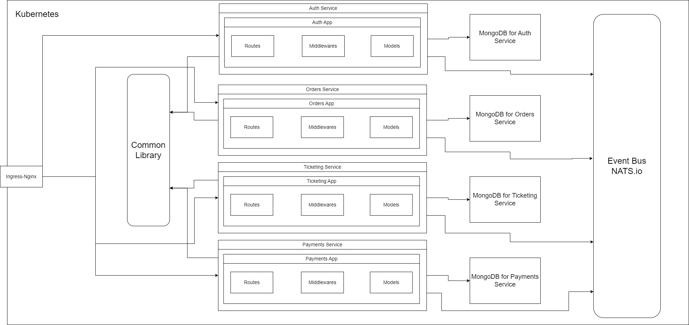

# Microservices Ticketing System

Event-driven ticketing platform built with Node.js, Kubernetes, and Next.js



## Features

- JWT-based user authentication
- Ticket purchasing with expiration
- Order management with payment processing
- Kubernetes cluster deployment
- Event bus using NATS Streaming Server

## Core Services

| Service    | Description                              | Port |
| ---------- | ---------------------------------------- | ---- |
| Auth       | User authentication & session management | 3000 |
| Client     | Next.js frontend application             | 3000 |
| Tickets    | Ticket creation/management               | 3000 |
| Orders     | Order processing system                  | 3000 |
| Payments   | Stripe payment integration               | 3000 |
| Expiration | Background order expiration processor    | N/A  |

## Technology Stack

### Shared Module (@tickets-packages/common)

- **Package Name**: `@tickets-packages/common` (version 1.0.17)
- **Purpose**: Reusable npm package containing shared infrastructure code
- **Key Components**:
  - **Authentication System**:
    - JWT verification middleware
    - Cookie session configuration
    - Current user context management
  - **Error Handling**:
    - Custom error classes (BadRequest, NotAuthorized, DatabaseConnection)
    - Centralized error handler middleware
  - **Event Bus**:
    - Base listener/publisher classes
    - NATS client configuration
    - Event type definitions
  - **Validation**:
    - Request validation middleware
    - Schema validation utilities
- **Publishing**:

  - Version updated with `npm version patch`
  - Built with TypeScript (`npm run build`)
  - Published to private registry (`npm publish`)

- **Frontend**: Next.js, React, Axios
- **Backend**: Node.js, Express, TypeScript
- **Database**: MongoDB (per service)
- **Event Bus**: NATS Streaming Server
- **Infrastructure**: Docker, Kubernetes, Skaffold
- **Auth**: JSON Web Tokens (JWT)

## Getting Started

### Prerequisites

- Docker Desktop with Kubernetes
- Skaffold
- Node.js v16+
- NATS Streaming Server

### Installation

```bash
git clone https://github.com/ahsandani001/microservices-ticketing.git
cd microservices-ticketing

# Install dependencies for each service
cd auth && npm install
cd ../client && npm install
cd ../common && npm install
cd ../expiration && npm install
cd ../orders && npm install
cd ../payments && npm install
cd ../tickets && npm install

```

### Deployment

```bash
# Start development environment
skaffold dev
```

## Environment Variables

Required variables for all services:

```env
JWT_KEY=your_jwt_secret
NATS_CLUSTER_ID=ticketing
NATS_CLIENT_ID=client
NATS_URL=nats://nats-srv:4222
```

## Kubernetes Setup

```bash
# Apply ingress-nginx
kubectl apply -f https://raw.githubusercontent.com/kubernetes/ingress-nginx/controller-v1.0.4/deploy/static/provider/cloud/deploy.yaml

# Create secret for JWT key
kubectl create secret generic jwt-secret --from-literal=JWT_KEY=your_secret
```

## Contributing

Pull requests welcome. For major changes, please open an issue first.

[](https://github.com/ahsandani001/microservices-ticketing)
